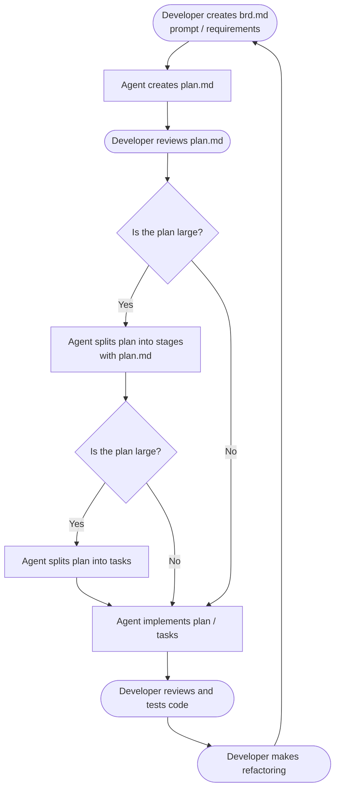
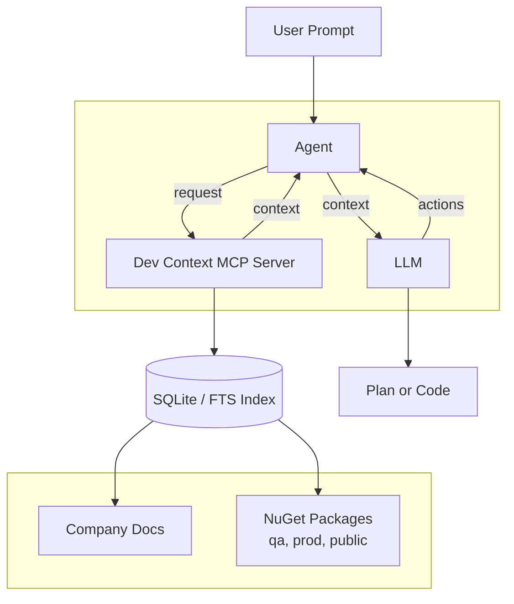

## Agenda

- How I Use Agentic Engineering in [have-fun](https://github.com/iJustHelp/have-fun/tree/main/design) project.  
[Development Workflow.](#development-workflow)

- [How Agent works](https://github.com/iJustHelp/dev-context-mcp-server/blob/main/design/theory.md)

- Where does the Agent learn about recent MudBlazor features for coding which are not in LLM?  
Answer: use [Context7 MCP  server](https://context7.com/?q=mublazor)  
[How Contex7 works?](https://chatgpt.com/c/6a3c56bc-66a8-83ea-8ca7-74dca74610a2)

- [Dev Context MCP Server Solution](#dev-context-mcp-server-solution)  

- [Dev Context MCP Server Configurations](https://github.com/iJustHelp/dev-context-mcp-server/blob/main/docs/indexer-configuration.md)  

- [Dev NuGet Apps](https://github.com/iJustHelp/dev-context-mcp-server/tree/main/demo/nuget-apps)  

- [Demo project](https://github.com/iJustHelp/dev-context-mcp-server-demo)

- Run Indexer, show analytic app, show logs.

- [How dev-context-mcp-server works.](https://github.com/iJustHelp/dev-context-mcp-server/blob/main/README.md)
 

### Development Workflow

>Do NOT code blindly!   
>Make the code human readable and maintainable.

---

### Dev Context MCP Server Solution

    
