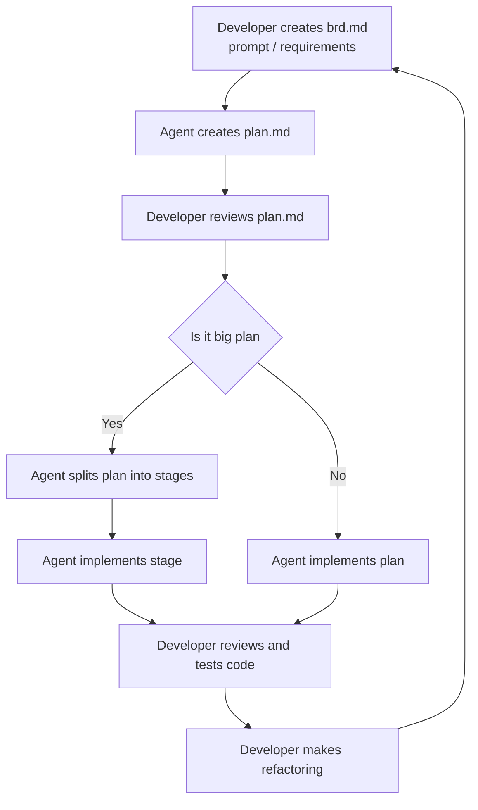

## Agenda

1. My Agentic Engineering Experience.

### Development Workflow

```mermaid
flowchart TD
    BRD[Developer creates brd.md<br/>prompt / requirements] --> Plan[Agent creates plan.md]
    Plan --> ReviewPlan[Developer reviews plan.md]
    ReviewPlan --> IsBigPlan{Is it big plan}
    IsBigPlan -- Yes --> SplitStages[Agent splits plan into stages]
    IsBigPlan -- No --> ImplementPlan[Agent implements plan]
    SplitStages --> ImplementStage[Agent implements stage]
    ImplementStage --> DevReview[Developer reviews and tests code]
    ImplementPlan --> DevReview
    DevReview --> Refactoring[Developer makes refactoring]
    Refactoring --> BRD
```    