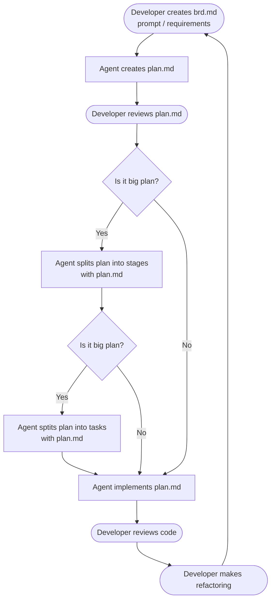

## Agenda

1. How I Use Agentic Engineering in [have-fun](https://github.com/iJustHelp/have-fun/tree/main/design) project.

### Development Workflow

```mermaid
flowchart TD
    BRD([Developer creates brd.md<br/>prompt / requirements]) --> Plan[Agent creates plan.md]
    Plan --> ReviewPlan([Developer reviews plan.md])
    ReviewPlan --> IsBigPlan{Is it big plan?}
    IsBigPlan -- Yes --> SplitStages[Agent splits plan into stages<br>with plan.md]
    SplitStages --> IsStageBig{Is it big plan?}
    IsStageBig -- Yes --> SplitTasks[Agent sptits plan into tasks<br>with plan.md]
    SplitTasks -->  ImplementPlan[Agent implements plan.md]
    IsBigPlan -- No --> ImplementPlan
    IsStageBig -- No --> ImplementPlan
    ImplementPlan --> DevReview([Developer reviews code])
    DevReview --> Refactoring([Developer makes refactoring])
    Refactoring --> BRD
```    

    
