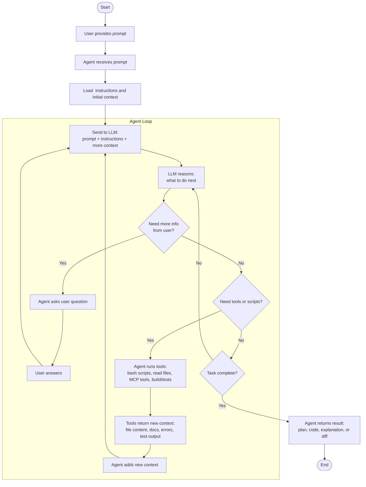
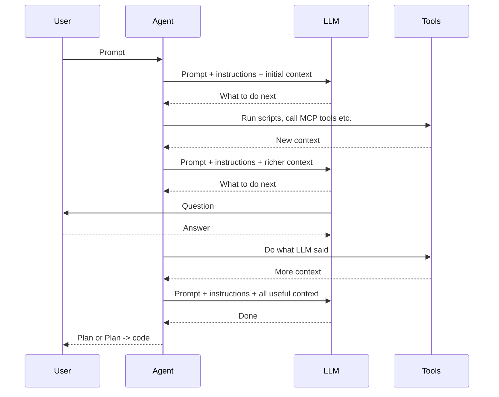
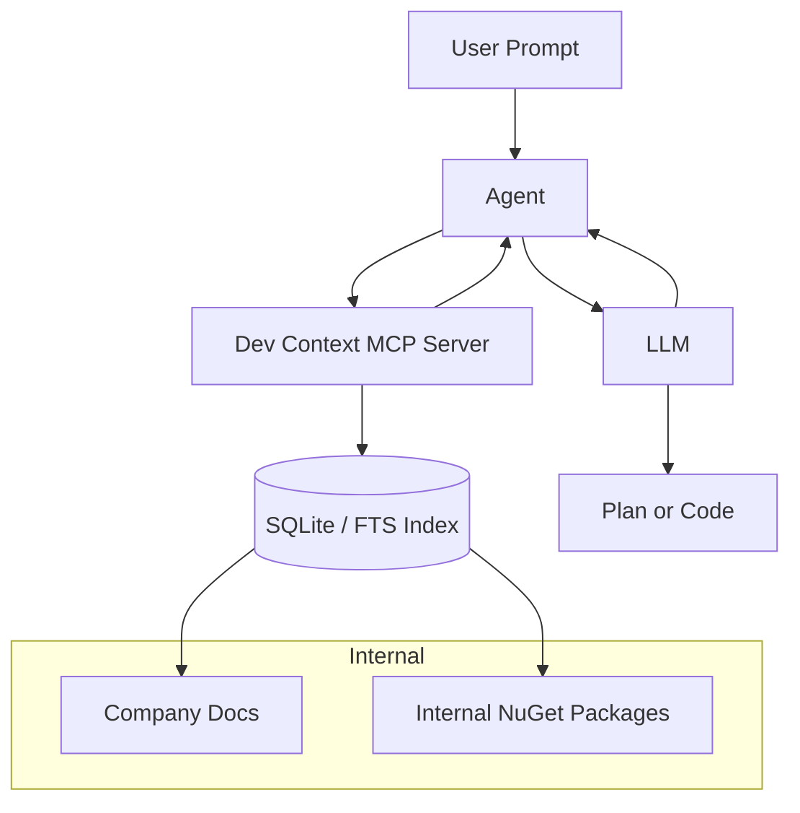

### Agent Loop

#### Flowchart

#### Sequence

>Good LLM knows to ask, good Agent knows to pass.

Agent and LLM are working together like 
- GitHub Copilot + Sonnet 4.6
- Codex + GPT 5.5
- Claude + Opus 4.8  

---

### Dev Context MCP Server Solution

