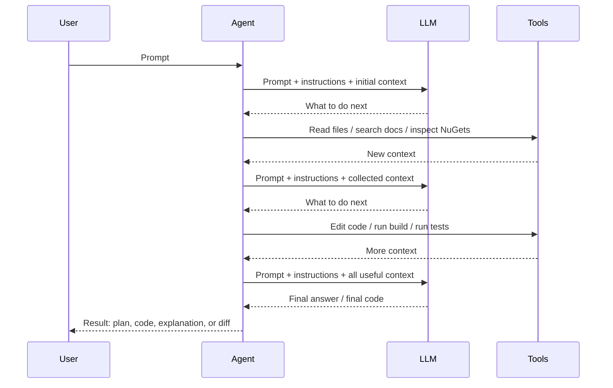
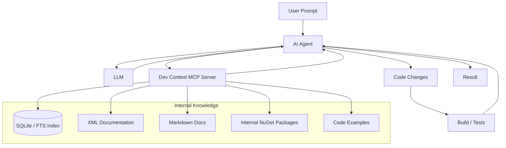

```mermaid
sequenceDiagram
    participant User
    participant Agent
    participant LLM
    participant Tools

    User->>Agent: Prompt

    Agent->>LLM: Prompt + instructions + initial context
    LLM-->>Agent: What to do next

    Agent->>Tools: Read files / search docs / inspect NuGets
    Tools-->>Agent: New context

    Agent->>LLM: Prompt + instructions + collected context
    LLM-->>Agent: What to do next

    Agent->>Tools: Edit code / run build / run tests
    Tools-->>Agent: More context

    Agent->>LLM: Prompt + instructions + all useful context
    LLM-->>Agent: Final answer / final code

    Agent-->>User: Result: plan, code, explanation, or diff
```
---

```mermaid
flowchart TD
    U[User Prompt] --> AGENT[AI Agent]

    AGENT --> LLM[LLM]

    AGENT --> MCP[Dev Context MCP Server]

    subgraph Internal Knowledge
        DB[(SQLite / FTS Index)]
        XML[XML Documentation]
        MD[Markdown Docs]
        PKG[Internal NuGet Packages]
        EX[Code Examples]
    end

    MCP --> DB
    MCP --> XML
    MCP --> MD
    MCP --> PKG
    MCP --> EX

    LLM --> AGENT
    MCP --> AGENT

    AGENT --> CODE[Code Changes]
    CODE --> BUILD[Build / Tests]
    BUILD --> AGENT
    AGENT --> RESULT[Result]
```