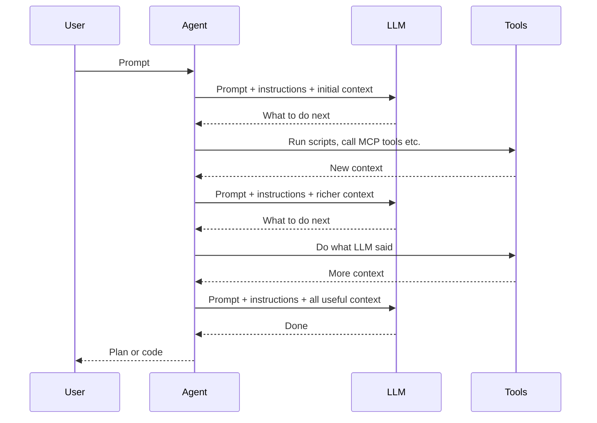
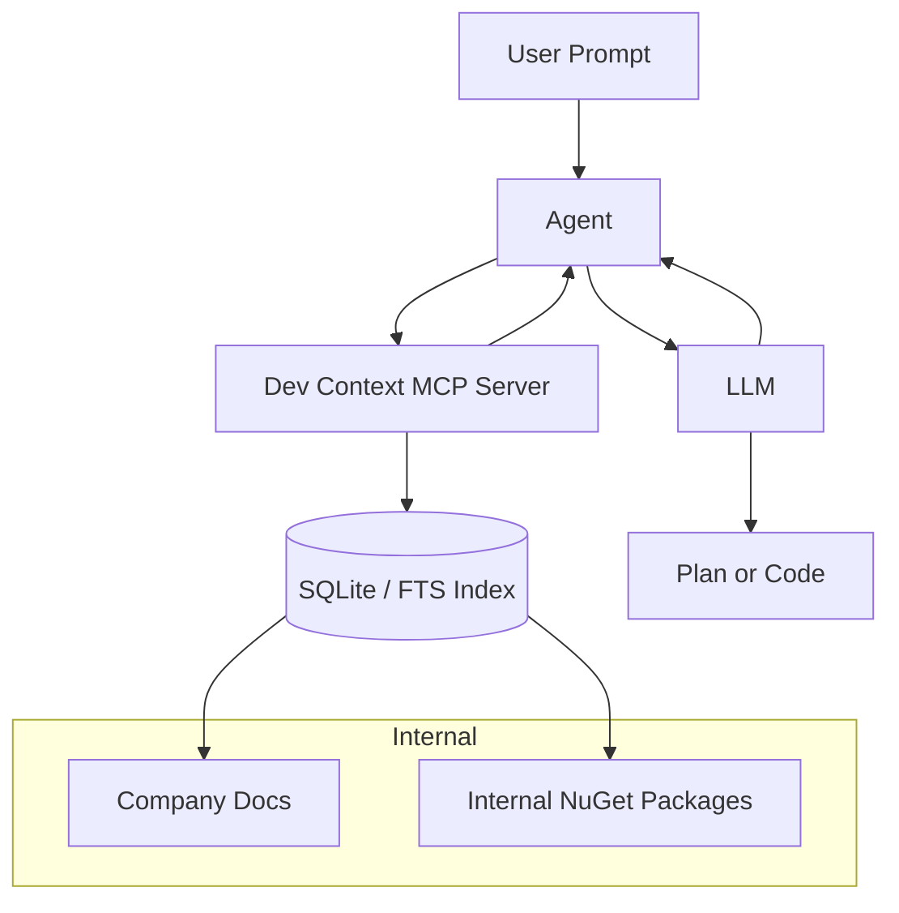

### AI Engineering

```mermaid
sequenceDiagram
    participant User
    participant Agent
    participant LLM
    participant Tools

    User->>Agent: Prompt

    Agent->>LLM: Prompt + instructions + initial context
    LLM-->>Agent: What to do next

    Agent->>Tools: Run scripts, call MCP tools etc.
    Tools-->>Agent: New context

    Agent->>LLM: Prompt + instructions + richer context
    LLM-->>Agent: What to do next

    Agent->>Tools: Do what LLM said
    Tools-->>Agent: More context

    Agent->>LLM: Prompt + instructions + all useful context
    LLM-->>Agent: Done

    Agent-->>User: Plan or code
```
---

### Dev Context MCP Server Solution

```mermaid
flowchart TD
    U[User Prompt] --> AGENT[Agent]

    AGENT --> LLM[LLM]

    AGENT --> MCP[Dev Context MCP Server]

    DB[(SQLite / FTS Index)]

    subgraph Internal
        MD[Company Docs]
        PKG[Internal NuGet Packages]
    end

    MCP --> DB
    DB --> MD
    DB --> PKG

    LLM --> AGENT
    MCP --> AGENT
    LLM --> RESULT[Plan or Code]
```