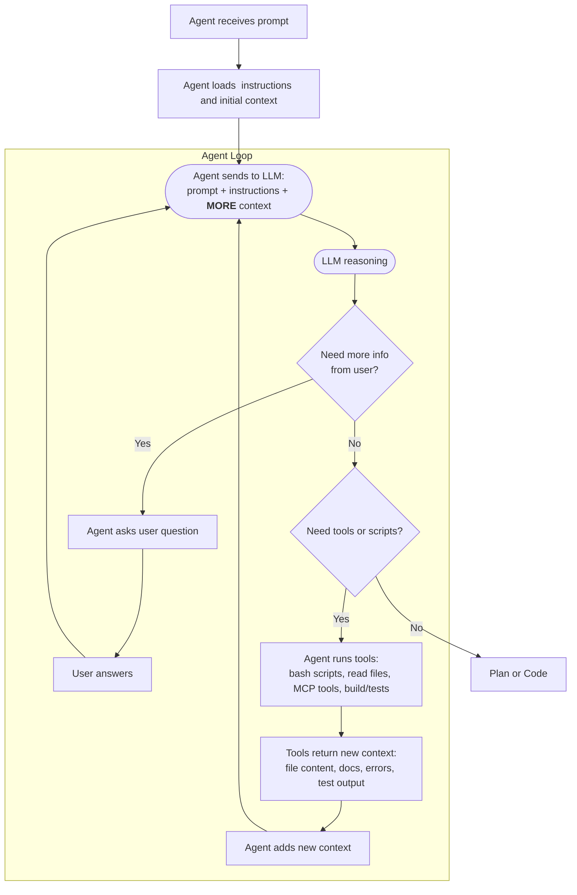
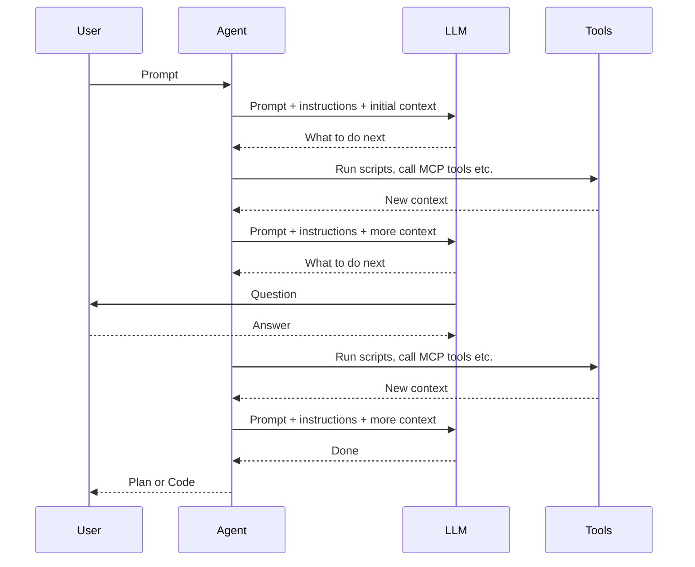

## AI Coding

```text
LLM(Context) = Plan
LLM(Context + Plan) = Code

where 
Context =
  Requirements +
  Existing code +
  Project structure +
  Framework/library versions +
  Documentation +
  Coding standards +
  Error messages +
  Test results +
  Previous conversation
```

>How we can enrich Context to help AI to make Plan?

### Agent Loop

#### Flowchart




#### Sequence


>Good LLM knows to ask, good Agent knows to pass.

Agent and LLM are working together like 
- GitHub Copilot + Sonnet 4.6
- Codex + GPT 5.5
- Claude + Opus 4.8  


---

### Coding Types

#### Traditional Coding

Requirement -> Design -> Manual Coding -> Auto and Manual Testing -> Developer Code Review -> QA -> Prod

#### Vibe Coding

Requirement -> AI Coding -> Manual Testing

#### Blind Coding

Requirement -> Design -> AI Coding -> AI Code Review -> Auto Testing -> Prod

#### AI-assisted Coding

Requirement -> Design -> AI Coding -> Manual Testing -> Developer Code Review -> QA -> Prod

| Coding Type | Code Control | Coding Speed | Ready for Prod |
|---|---|---|---|
| Traditional| Full | Slow | Yes |
| Vibe| No | Fastest | No|
| Blind| Partial| Fast | Yes?|
| AI-assisted| Full | Fast| Yes |


