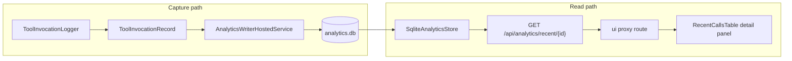

# Analytics Not-Ok Detail: BRD and Implementation Plan

## Context

The draft BRD at [`design/ver 3.0/cursor/analytic-changes.md/brd.md`](design/ver%203.0/cursor/analytic-changes.md/brd.md) contains two bullets:

- Persist extra information in the analytics database when a call is not ok
- Show that information in the UI when the user clicks a non-ok row in **Recent calls**

Today the stack already records invocation metadata ([`ToolInvocationRecord`](src/DevContextMcp.Server.Core/Models/Analytics/ToolInvocationRecord.cs), [`AnalyticsSchema`](src/DevContextMcp.Infrastructure/Analytics/AnalyticsSchema.cs) v2), including `tool_result_status` and `error_type` (exception type only). What is **missing**:

- Tool-level failure context from [`ToolResponse<T>.Errors`](src/DevContextMcp.Server.Core/Contracts/Common/ToolResponse.cs) and optional [`ResolvedContext`](src/DevContextMcp.Server.Core/Contracts/Common/ResolvedContext.cs) when handlers return `not_found`, `insufficient_evidence`, etc.
- Any API surface to retrieve that detail
- Any UI interaction on [`RecentCallsTable`](ui/components/RecentCallsTable.tsx) (rows are read-only)



---

## Phase 0 — Write the full BRD

Replace the two-line draft with a structured BRD matching the style of [`design/ver 1.0/stages/01-skeleton/brd.md`](design/ver%201.0/stages/01-skeleton/brd.md).

### Purpose

Give operators and developers enough context to diagnose failed or partial MCP tool outcomes from the analytics dashboard without enabling debug logging or persisting request/response payloads.

### Business outcome

When a recent call has a non-ok tool result (or transport failure), the dashboard user can click the row and see **why** it failed (error codes/messages, exception type, resolved library/version context).

### Definitions

| Term | Meaning |
|------|---------|
| **Not ok** | `toolResultStatus != "ok"` **or** transport `status != "success"` |
| **Detail** | Metadata-only summary: `errors[]`, optional `resolvedContext`, optional `errorType` |

### Functional requirements

**FR-1: Capture detail on write**

When analytics capture records a not-ok invocation, persist a bounded JSON detail payload derived from the tool response envelope:

- `errors`: `{ code, message }[]` from `ToolResponse.Errors` (when present)
- `resolvedContext`: `{ libraryId, sourceId, environment, version, versionSelectionReason }` when present
- `errorType`: existing exception type name for transport failures

Do **not** persist request bodies, response `data`, fragments, symbols, evidence, or citations.

**FR-2: Schema migration**

- Bump [`AnalyticsSchema.Version`](src/DevContextMcp.Infrastructure/Analytics/AnalyticsSchema.cs) from `2` → `3`
- Add nullable column `result_detail_json TEXT` to `tool_invocations`
- Extend [`MigrateAsync`](src/DevContextMcp.Infrastructure/Analytics/SqliteAnalyticsStore.cs) with `ALTER TABLE ... ADD COLUMN` (same pattern as `tool_result_status`)

**FR-3: Detail read API**

Add `GET /api/analytics/recent/{id}`:

- Returns `404` when id not found (within optional `from`/`to` window, same validation as other analytics endpoints)
- Returns a `RecentCallDetail` model with base call fields plus parsed detail
- Registered in [`AnalyticsEndpoints.cs`](src/DevContextMcp.Server/api/AnalyticsEndpoints.cs)

**FR-4: Recent list affordance**

Extend [`RecentCall`](src/DevContextMcp.Server.Core/Models/Analytics/RecentCall.cs) with `hasDetail: bool` so the UI can style clickable rows without fetching every detail up front.

**FR-5: Dashboard detail UI**

In [`RecentCallsTable.tsx`](ui/components/RecentCallsTable.tsx):

- Rows with `hasDetail === true` are clickable (cursor, hover, keyboard focus)
- Click opens a detail panel (modal or slide-over — no existing modal component; add minimal CSS in [`globals.css`](ui/app/globals.css))
- Fetch detail via new proxy route in [`ui/app/api/analytics/[endpoint]/route.ts`](ui/app/api/analytics/[endpoint]/route.ts) — either extend allowed endpoints or add a dedicated `recent/[id]` route
- Display: tool result status, transport status, error type (if any), error list, resolved context fields

**FR-6: Size and safety limits**

- Cap serialized `result_detail_json` (e.g. 4 KB, aligned with [`ToolLoggingOptions.MaxPayloadBytes`](src/DevContextMcp.Server/Configuration/ToolLoggingOptions.cs) mindset)
- Truncate excess errors rather than failing capture
- Capture failures must never affect tool behavior (existing invariant)

### Non-functional requirements

- Metadata-only storage (consistent with [`design/ver 2.0/spec-claude.md`](design/ver%202.0/spec-claude.md) §11)
- Backward compatible: existing rows have `result_detail_json = NULL`, `hasDetail = false`
- OpenAPI + generated TS types regenerated ([`ui/openapi.json`](ui/openapi.json), `npm run gen:api`)

### Out of scope

- Storing full tool request/response payloads
- Showing detail for `ok` rows (including rows that only have warnings)
- Changing aggregate KPIs, charts, or tool-result breakdown logic
- Authentication/authorization on analytics endpoints

### Acceptance criteria

1. A `not_found` / `insufficient_evidence` tool response persists at least one `{ code, message }` error in `result_detail_json`
2. A thrown exception persists `errorType` and detail is retrievable via the new endpoint
3. Recent list marks non-ok rows with `hasDetail: true`
4. Clicking a non-ok row in the dashboard shows the stored detail; ok rows are not clickable
5. `dotnet test` and `npm run build` pass; existing analytics aggregations unchanged

---

## Phase 1 — Backend models and capture

| File | Change |
|------|--------|
| [`ToolInvocationRecord.cs`](src/DevContextMcp.Server.Core/Models/Analytics/ToolInvocationRecord.cs) | Add `string? ResultDetailJson` |
| New `ToolInvocationResultDetail.cs` | Typed detail DTO: `Errors`, `ResolvedContext` (analytics-specific, not tool contract types in DB layer) |
| New `RecentCallDetail.cs` | API response for detail endpoint |
| [`RecentCall.cs`](src/DevContextMcp.Server.Core/Models/Analytics/RecentCall.cs) | Add `bool HasDetail` |
| [`ToolInvocationLogger.cs`](src/DevContextMcp.Server/Tools/ToolInvocationLogger.cs) | After `GetToolResultStatus`, extract detail via reflection on `ToolResponse<>` (`Errors`, `ResolvedContext`); serialize when not ok; pass to `RecordAnalytics` |
| [`SqliteAnalyticsStore.cs`](src/DevContextMcp.Infrastructure/Analytics/SqliteAnalyticsStore.cs) | Write/read `result_detail_json`; compute `HasDetail` in `GetRecentAsync`; add `GetRecentDetailAsync` |
| [`IToolInvocationReadStore.cs`](src/DevContextMcp.Server.Core/Infrastructure/IToolInvocationReadStore.cs) | Add `GetRecentDetailAsync` |
| [`AnalyticsEndpoints.cs`](src/DevContextMcp.Server/api/AnalyticsEndpoints.cs) | Map `GET /recent/{id}` |

**Capture logic sketch** (in `ToolInvocationLogger`):

```csharp
// When toolResultStatus != "ok" OR transport status != success:
// - Build ToolInvocationResultDetail from response.Errors + response.ResolvedContext
// - For exceptions: ErrorType already set; detail may only contain errorType
// - Serialize with JsonSerializer; if over limit, keep first N errors
```

---

## Phase 2 — Tests

| Test file | Coverage |
|-----------|----------|
| [`ToolInvocationLoggerCaptureTests.cs`](tests/DevContextMcp.UnitTests/Analytics/ToolInvocationLoggerCaptureTests.cs) | NotFound response with `Errors` → detail JSON captured; Ok response → null detail |
| [`SqliteAnalyticsStoreTests.cs`](tests/DevContextMcp.UnitTests/Analytics/SqliteAnalyticsStoreTests.cs) | Round-trip write/read detail; migration adds column; `GetRecentDetailAsync` 404; `HasDetail` on recent list |
| New integration test (optional, small) | `GET /api/analytics/recent/{id}` returns detail for seeded non-ok row |

Update `Record(...)` helper in store tests to accept optional `resultDetailJson`.

---

## Phase 3 — Dashboard and contract

| File | Change |
|------|--------|
| [`ui/app/api/analytics/[endpoint]/route.ts`](ui/app/api/analytics/[endpoint]/route.ts) or new `recent/[id]/route.ts` | Proxy detail endpoint |
| [`ui/lib/client.ts`](ui/lib/client.ts) | Add `getRecentCallDetail(id, query)` |
| [`ui/lib/types.ts`](ui/lib/types.ts) | Export `RecentCallDetail` from generated schema |
| [`RecentCallsTable.tsx`](ui/components/RecentCallsTable.tsx) | Click handler, detail fetch, panel component |
| New `RecentCallDetailPanel.tsx` | Renders errors + resolved context |
| [`globals.css`](ui/app/globals.css) | Modal/panel styles consistent with existing cards/tables |
| [`ui/openapi.json`](ui/openapi.json) + `npm run gen:api` | Regenerate from running server |

---

## Phase 4 — Verification

1. `dotnet build` / `dotnet test`
2. `npm run build` in `ui/`
3. Manual smoke test:
   - Trigger a `not_found` or `insufficient_evidence` MCP call
   - Confirm row appears in Recent calls with clickable styling
   - Confirm detail panel shows error code/message and library context
4. Confirm ok rows remain non-interactive and aggregate charts unchanged

---

## Risk notes

- **Pre-v3 databases**: migration adds nullable column; old rows show no detail (expected)
- **Pre-v3 non-ok rows**: cannot backfill detail that was never captured
- **Reflection on `ToolResponse<>`**: acceptable here (same pattern as existing `GetToolResultStatus`); keep extraction in one private helper

---

## Deliverables summary

1. Full BRD document at [`design/ver 3.0/cursor/analytic-changes.md/brd.md`](design/ver%203.0/cursor/analytic-changes.md/brd.md)
2. Analytics schema v3 + capture + detail API
3. Dashboard click-to-detail UX for non-ok recent calls
4. Unit tests and regenerated OpenAPI/TS types
