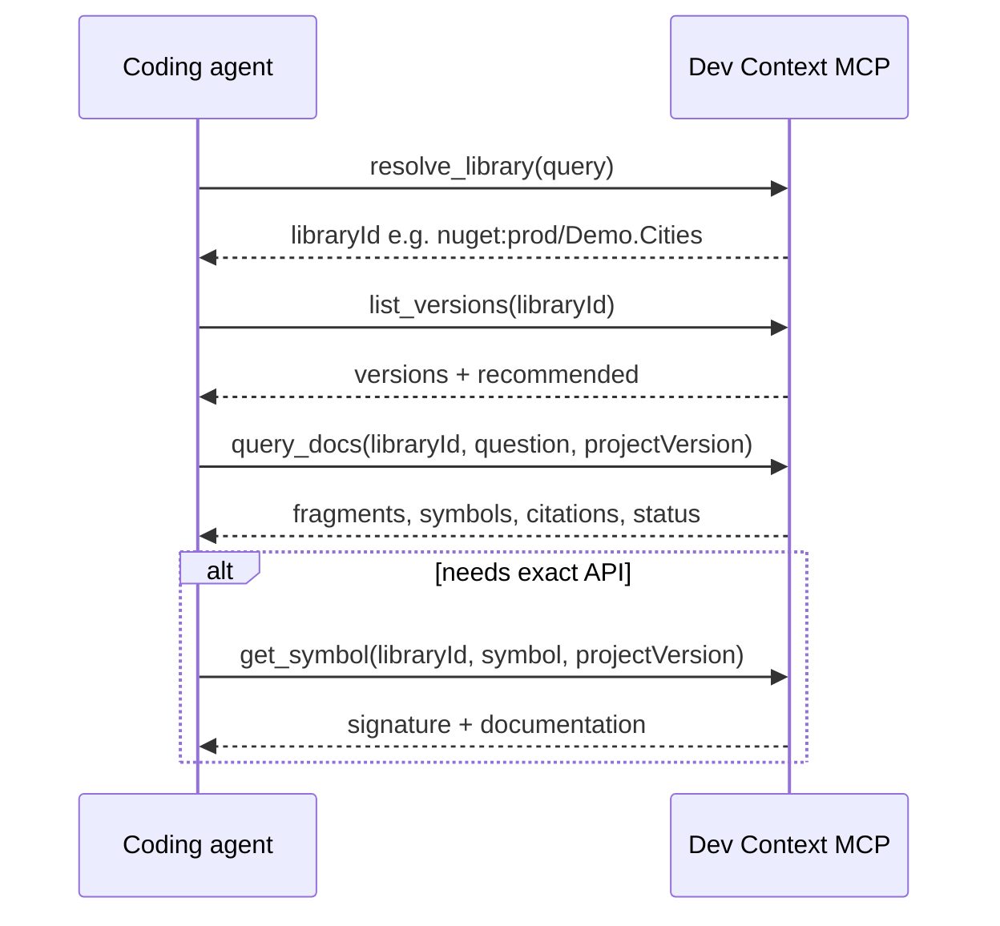

# Code review: recent changes for AI MCP usage

I reviewed the latest commits (`improve chunk`, `tests`, `skills`, and the broader NuGet-only / evidence refactor). Overall, **these changes are a clear improvement for AI agents using the MCP server** — tighter scope, better retrieval quality, and tests that mirror how agents actually call tools.

---

## Summary verdict

| Area | Impact for AI MCP |
|------|-------------------|
| NuGet-only MCP surface | Strong positive — fewer wrong tool paths |
| `dev-context` skill | Strong positive — encodes the intended agent workflow |
| Chunking + BM25 ranking | Strong positive — better `query_docs` answers |
| Evidence/text split in responses | Positive — less JSON noise, clearer structure |
| `QueryDocsSimulatedCallsTests` | Strong positive — validates real MCP call patterns |
| Startup diagnostics | Neutral — ops reliability, not agent-facing |

---

## What works well for AI agents

### 1. Narrower, clearer MCP contract

Removing company docs from MCP (NuGet-only) and moving standards into Cursor skills is the right split:

- Agents call MCP for **package truth** (`resolve_library` → `list_versions` → `query_docs` / `get_symbol`).
- Repo-local conventions live in **skills**, which load automatically in Cursor.

That reduces confusion where an agent might have chosen `docs:company-docs/...` vs `nuget:prod/...`.

### 2. `dev-context` skill matches the server design

The skill at `.agents/skills/dev-context/SKILL.md` aligns with README and tool descriptions:

```18:28:c:\.iJustHelp\dev-context-mcp-server\.agents\skills\dev-context\SKILL.md
## Workflow

1. Call `resolve_library` with the package name, client name, type name, or
   implementation concept.
2. Call `list_versions` and select a version compatible with the current
   project. Prefer the project's referenced version when known.
3. Use `query_docs` for implementation guidance, examples, warnings, and usage
   patterns.
4. Use `get_symbol` only for a specific public type or member.
5. Preserve citation URIs and mention important warnings, missing
   documentation, or insufficient evidence.
```

This is exactly what agents need: explicit ordering, version discipline, and “don’t invent APIs” guardrails.

### 3. Tool descriptions guide query shape

`query_docs` already nudges agents toward short, topical questions:

```21:24:c:\.iJustHelp\dev-context-mcp-server\src\DevContextMcp.Server\Tools\QueryDocsTool.cs
    public Task<QueryDocsResponse> QueryDocsAsync(
        [Description("Stable library identifier returned by resolve_library.")] string libraryId,
        [Description("A focused topic or question. Short, topical queries (1–3 words near the document's subject) retrieve best; broaden first, then narrow.")] string question,
```

That pairs well with `FtsQueryBuilder`, which tokenizes and ANDs terms — short queries like `"authentication"` or `"getting started"` match how FTS works best.

### 4. Chunking changes directly improve retrieval

The `improve chunk` commit adds meaningful indexing improvements:

- **Section-aware splitting** on blank lines and `\n#` headings.
- **`MinDocumentChars`** filters tiny/noise chunks.
- **Boundary-aware splits** at paragraph/sentence/word breaks instead of hard cuts.
- **XML fallback** when member parsing fails — fewer silent drops.

The integration tests encode an important invariant:

```29:30:c:\.iJustHelp\dev-context-mcp-server\tests\DevContextMcp.IntegrationTests\Retrieval\QueryDocsSimulatedCallsTests.cs
        // Single newline between heading and content keeps them in one FTS chunk.
        const string readmeV1 =
```

That shows the team understands chunk boundaries affect whether `"getting started"` returns useful text, not just a heading.

### 5. BM25-based ranking replaces positional decay

Before, document rank was `0.7 - (position * 0.02)` — essentially “first SQL row wins,” regardless of relevance. Now:

```336:343:c:\.iJustHelp\dev-context-mcp-server\src\DevContextMcp.Infrastructure\Server\SqliteNuGetReadStore.cs
        return rawRows
            .Select(row => new DocumentHitRecord(
                ...
                Rank: Math.Max(0.05, Math.Min(0.9, Math.Abs(row.Bm25) / maxAbs * 0.9))))
            .ToList();
```

Agents get fragments ranked by FTS relevance, then `QueryDocsHandler` adds kind bonuses (`readme` +0.10, `xml_documentation` +0.05). That produces more predictable answers for topical questions.

### 6. Cleaner response shape for agents

Splitting full text into `data.fragments` / `data.symbols` while keeping `evidence` as metadata-only avoids duplicating large strings:

```48:59:c:\.iJustHelp\dev-context-mcp-server\src\DevContextMcp.Server.Core\Services\RetrievalHandlerSupport.cs
    public static EvidenceItem ToEvidenceMetadata(
        string kind,
        string title,
        double score,
        string citationUri) =>
        new()
        {
            Kind = kind,
            Title = title,
            Score = score,
            CitationUri = citationUri
        };
```

Agents can read `data.fragments[].text` for content and `citations` / `citationUri` for provenance — a good MCP pattern.

### 7. Simulated MCP tests are the right validation layer

`QueryDocsSimulatedCallsTests` exercises **real MCP tool calls**, not just handler unit tests:

- Broad question → fragments returned
- Topic question → relevant content (`AuthToken`, etc.)
- Version-scoped query → correct `resolvedContext.version`
- Unknown topic → `ok` or `insufficient_evidence`, never throws
- Full workflow: `resolve_library` → `query_docs`

That last test (`SimulatedCall_FullAiWorkflow_ResolveLibraryThenQueryDocs`) is especially valuable — it validates the exact multi-step pattern agents use.

---

## Gaps and risks to watch

### 1. Re-index required for chunk improvements

Chunking and BM25 ranking changes affect **newly indexed content only**. Existing `database/docs.db` files keep old chunks until re-run of the Indexer. Agents may see inconsistent quality until indexes are refreshed.

### 2. Markdown with blank lines after headings can split poorly

`SplitSections` splits on `\n\n` and `\n#`:

```164:172:c:\.iJustHelp\dev-context-mcp-server\src\DevContextMcp.Infrastructure\Indexer\Processing\DocumentChunker.cs
    private static IReadOnlyList<string> SplitSections(string content)
    {
        var normalized = content.ReplaceLineEndings("\n");
        // Blank lines and Markdown headings are useful retrieval boundaries.
        var sections = normalized.Split(
            ["\n\n", "\n#"],
            StringSplitOptions.RemoveEmptyEntries | StringSplitOptions.TrimEntries);
```

Common README style:

```markdown
## Getting Started

Install the package...
```

…produces a **heading-only chunk** (~17 chars) separate from the body. Queries like `"getting started"` may match the heading but return little actionable text. The test fixture avoids this with a single newline; many real READMEs won't.

**Suggestion (when you implement):** treat `## heading\n\nbody` as one section, or merge heading-only chunks with the following section.

### 3. `MinDocumentChars` dropped from 80 → 15

```17:19:c:\.iJustHelp\dev-context-mcp-server\src\DevContextMcp.Indexer\Configuration\IndexingOptions.cs
    public int MaxDocumentChars { get; set; } = 4_000;

    public int MinDocumentChars { get; set; } = 15;
```

15 chars is very permissive — short headings and labels will index. That may help recall but can also add low-signal FTS hits. Worth monitoring whether agents get more `insufficient_evidence` or noisier fragments in production.

### 4. FTS uses AND across all tokens

`FtsQueryBuilder` joins tokens with `AND`:

```29:29:c:\.iJustHelp\dev-context-mcp-server\src\DevContextMcp.Infrastructure\Server\FtsQueryBuilder.cs
        return string.Join(" AND ", tokens);
```

Long agent questions like `"error handling retry policy transient failures"` require **every** token to match. The simulated test `"error handling retry"` passes on your fixture, but verbose natural-language questions may hit `insufficient_evidence` more often than short ones.

The tool description already hints at short queries — consider reinforcing that in the skill or server instructions.

### 5. Simulated workflow skips `list_versions`

The skill says step 2 is `list_versions`, but `SimulatedCall_FullAiWorkflow` goes straight from `resolve_library` to `query_docs`. That works when default version selection is fine, but agents implementing APIs against a specific project version should always call `list_versions` and pass `projectVersion`.

Adding a third simulated test with `list_versions` + `projectVersion` would better match the documented workflow.

### 6. `examples` array is always empty

`QueryDocsResult` still exposes `examples`, but nothing populates it. Agents may look for code samples there and find nothing. Either populate it later or document that examples live in `fragments` / symbol docs for now.

### 7. Startup checks help ops, not agents directly

```30:59:c:\.iJustHelp\dev-context-mcp-server\src\DevContextMcp.Server\Diagnostics\StartupDiagnosticsHostedService.cs
        if (!toolCatalog.Names.SequenceEqual(ToolRegistrationCatalog.ExpectedNames, StringComparer.Ordinal))
        {
            throw new InvalidOperationException("The registered MCP tool catalog is incomplete.");
        }
        ...
        if (localResults.Any(result => !result.Succeeded))
        {
            throw new InvalidOperationException("One or more startup diagnostics failed.");
        }
```

Good for fail-fast when the DB path is wrong or tools are misregistered. Agents never see this — they just get connection errors if startup fails. Fine as-is.

---

## Recommended agent workflow (validated by your tests)



---

## Bottom line

**Yes — the recent changes are better for AI MCP usage**, mainly because they:

1. Focus MCP on NuGet retrieval only.
2. Improve how documentation is chunked and ranked.
3. Return structured, citation-backed responses with explicit statuses.
4. Add integration tests that mirror real agent tool calls.
5. Ship a `dev-context` skill that teaches the correct workflow.

The main follow-ups I'd prioritize: **re-index existing databases**, **harden markdown heading/body chunking for common README layout**, and **extend simulated tests to cover `list_versions` + `projectVersion`**.

If you meant something specific by “last checkings” (startup diagnostics vs. the chunk/test commits), say which and I can go deeper on that slice only. To apply fixes, switch to Agent mode.