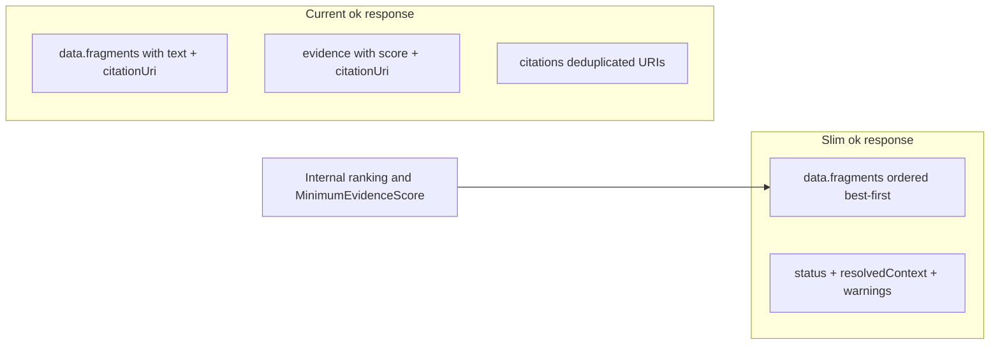

# Token-efficient MCP response envelope

## Goal

Reduce agent token usage on successful tool calls by **omitting `evidence` and `citations` from JSON** when they add no decision value. Ranking, score thresholds, and response budgets stay **internal**; agents read **ordered content + `citationUri` + `status`**.



## Target response shape

**`query_docs` / `get_symbol` on `ok`:**

```json
{
  "status": "ok",
  "resolvedContext": { ... },
  "data": {
    "fragments": [{ "title": "...", "text": "...", "citationUri": "nuget://..." }],
    "symbols": [{ "name": "...", "signature": "...", "citationUri": "nuget://..." }]
  },
  "warnings": []
}
```

**Unchanged:**

- `resolve_library` → `data.matches[].confidence` (small, useful for disambiguation)
- `list_versions` → no evidence today
- Error paths → `errors`, `warnings`, `resolvedContext` as today
- `get_symbol` ambiguous → `data.candidates[]` each with `citationUri` (already sufficient)

**Breaking change:** clients that read `evidence[]` or top-level `citations[]` on `ok` must switch to `data.*.citationUri`. UI analytics dashboard does not consume these fields.

---

## Phase 1 — Contract and serialization

### [`src/DevContextMcp.Server.Core/Contracts/Common/ToolResponse.cs`](src/DevContextMcp.Server.Core/Contracts/Common/ToolResponse.cs)

- Make `Evidence` and `Citations` **nullable** (`IReadOnlyList<...>?`, default `null`).
- Add `[JsonIgnore(Condition = JsonIgnoreCondition.WhenWritingNull)]` so omitted properties are not serialized (no `"evidence":[]` overhead).
- Update XML docs: optional metadata envelope; on successful retrieval responses agents should use ordered `data` payloads.

### [`src/DevContextMcp.Server.Core/Contracts/Common/EvidenceItem.cs`](src/DevContextMcp.Server.Core/Contracts/Common/EvidenceItem.cs)

- Keep type for schema/OpenAPI backward reference; document as **optional debug/metadata**, not populated on normal `ok` responses.

No change to [`DocumentFragment`](src/DevContextMcp.Server.Core/Contracts/QueryDocs/QueryDocsResponse.cs) / [`SymbolDetails`](src/DevContextMcp.Server.Core/Contracts/GetSymbol/GetSymbolResponse.cs) — they already carry `citationUri`.

---

## Phase 2 — Handlers (ranking stays internal)

### [`src/DevContextMcp.Server.Core/Services/QueryDocsHandler.cs`](src/DevContextMcp.Server.Core/Services/QueryDocsHandler.cs)

On `ok`:
- **Remove** construction of `Evidence` and `Citations` (delete `citations` local + `ToEvidenceMetadata` mapping).
- Keep existing pipeline: rank → filter by `MinimumEvidenceScore` → `ResponseBudget.Take` → map to `data.fragments` / `data.symbols` (order preserved).

On `insufficient_evidence` / `not_found`: leave `Evidence`/`Citations` unset (`null`).

### [`src/DevContextMcp.Server.Core/Services/GetSymbolHandler.cs`](src/DevContextMcp.Server.Core/Services/GetSymbolHandler.cs)

On `ok`:
- **Remove** `Evidence` and `Citations` assignment; `data.symbol.citationUri` is sufficient.

On ambiguous symbol (`InsufficientEvidence` + `candidates`): no change — candidates already include `citationUri`.

### [`src/DevContextMcp.Server.Core/Services/RetrievalHandlerSupport.cs`](src/DevContextMcp.Server.Core/Services/RetrievalHandlerSupport.cs)

- Remove `ToEvidenceMetadata` if unused after handler changes.

**No changes** to [`ResolveLibraryHandler.cs`](src/DevContextMcp.Server.Core/Services/ResolveLibraryHandler.cs) or [`ListVersionsHandler.cs`](src/DevContextMcp.Server.Core/Services/ListVersionsHandler.cs).

---

## Phase 3 — Tool descriptions and agent guidance

### [`src/DevContextMcp.Server/Tools/QueryDocsTool.cs`](src/DevContextMcp.Server/Tools/QueryDocsTool.cs)

- Change `maxResults` description from “evidence results” to “fragments and symbols”.

### [`src/DevContextMcp.Server/Program.cs`](src/DevContextMcp.Server/Program.cs) (`ServerInstructions`)

- Step 5: cite `data.fragments[].citationUri` / `data.symbol.citationUri` instead of generic “citation URIs from evidence”.

### [`.agents/skills/dev-context/SKILL.md`](.agents/skills/dev-context/SKILL.md)

- Step 6: read citations from `data.fragments` / `data.symbols` / `data.symbol`, not `evidence`.
- Note: results are **ordered best-first**; prefer the first 1–2 fragments for narrow questions.

---

## Phase 4 — Tests

Update assertions that expect `evidence` / `citations` on `ok`:

| File | Change |
|------|--------|
| [`tests/DevContextMcp.IntegrationTests/Retrieval/NuGetRetrievalPipelineTests.cs`](tests/DevContextMcp.IntegrationTests/Retrieval/NuGetRetrievalPipelineTests.cs) | Assert `citationUri` on fragments; assert `evidence`/`citations` absent or null |
| [`tests/DevContextMcp.IntegrationTests/Retrieval/EnvironmentAwareRetrievalTests.cs`](tests/DevContextMcp.IntegrationTests/Retrieval/EnvironmentAwareRetrievalTests.cs) | Same |
| [`tests/DevContextMcp.UnitTests/Retrieval/GetSymbolHandlerTests.cs`](tests/DevContextMcp.UnitTests/Retrieval/GetSymbolHandlerTests.cs) | Assert `data.symbol.citationUri`; drop evidence/citations checks on ok |
| [`tests/DevContextMcp.UnitTests/Contracts/ToolContractSerializationTests.cs`](tests/DevContextMcp.UnitTests/Contracts/ToolContractSerializationTests.cs) | `not_found`: assert `evidence`/`citations` keys **absent** from JSON (not empty arrays) |
| Add slim-response serialization test | Serialize a `QueryDocsResponse` with fragments; verify no `evidence`/`citations` keys in output |

Add integration assertion in [`QueryDocsSimulatedCallsTests.cs`](tests/DevContextMcp.IntegrationTests/Retrieval/QueryDocsSimulatedCallsTests.cs): MCP `query_docs` ok response JSON lacks `evidence` and `citations`.

Run: `dotnet test DevContextMcp.slnx`

---

## Phase 5 — Docs and OpenAPI

### [`design/spec.md`](design/spec.md) §5

- Revise: successful responses return `status`, `data`, `resolvedContext`, `warnings`, `errors`.
- `evidence` / `citations` are **optional** envelope fields, omitted on normal `ok` retrieval responses.
- Citations for agents live on `data` items via `citationUri`.

### [`README.md`](README.md)

- MCP Surface section: describe slim `ok` shape; note ordered fragments.

### OpenAPI / UI types

- Regenerate [`ui/openapi.json`](ui/openapi.json) from running server (`/openapi/v1.json`).
- Run `npm run gen:api` in `ui/` to refresh [`ui/lib/generated/schema.d.ts`](ui/lib/generated/schema.d.ts).

---

## What we explicitly do NOT change

- Internal ranking (BM25, symbol tiers, readme bonus, deprecation penalty)
- `MinimumEvidenceScore` filtering
- `MaxResponseBytes` / `maxResults` budgets
- `resolve_library` `confidence`
- Analytics (metadata-only; no evidence content stored)

---

## Verification checklist

1. `query_docs` ok → JSON has `data.fragments`, no `evidence`/`citations` keys
2. `get_symbol` ok → `data.symbol.citationUri` present, no envelope citations
3. `resolve_library` ok → `confidence` still on matches
4. `insufficient_evidence` / `not_found` → `errors` unchanged; no spurious evidence arrays
5. Fragment order still matches relevance (existing integration tests for content relevance still pass)
6. Re-index not required (response-only change)
