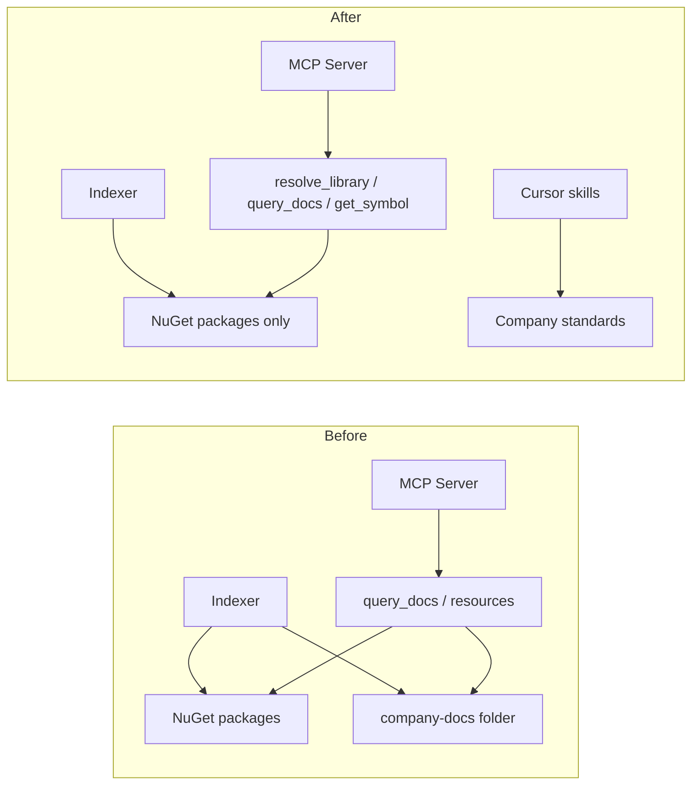

# Remove Company Docs from MCP

## Goal

Narrow Dev Context MCP to **NuGet packages only**. Company standards currently indexed as `docs:company-docs` move to **project Cursor skills** under [`.cursor/skills/`](.cursor/skills/).

**Keep unchanged:** NuGet indexing, `query_docs` for package README/XML/packaged text, `get_symbol`, `list_versions`, `nuget://` resources, shared SQLite schema (`document_chunks` still used for NuGet artifacts).

**Out of scope:** SQLite schema version bump or automatic purge of existing `kind='docs'` rows (harmless orphans; delete `database/docs.db` and re-index for a clean slate).

---

## Phase 1 — Migrate demo docs to Cursor skills

Create three project skills from [`demo/data/indexer/company-docs/`](demo/data/indexer/company-docs/):

| Skill directory | Source file | Description trigger |
|-----------------|-------------|---------------------|
| `.cursor/skills/api-architecture/` | `api.architecture.md` | STI API project structure, dependency direction, services/repos |
| `.cursor/skills/csharp-naming/` | `code-naming-convension.md` | C# naming, member ordering, constructor style |
| `.cursor/skills/unit-test-generation/` | `test-template.instructions.md` | xUnit + Moq test structure, naming, templates |

Each skill needs a `SKILL.md` with YAML frontmatter (`name`, `description`) per the [create-skill](C:\Users\my-pc\.cursor\skills-cursor\create-skill\SKILL.md) format. Copy the markdown body from the source files (preserve wording).

**Important edit in `unit-test-generation`:** Keep the **Formula.SimpleRepo Mocking Workflow** section but frame it as “use Dev Context MCP NuGet tools” (`resolve_library` → `list_versions` → `get_symbol` → `query_docs`). Remove any reference to `docs:company-docs`.

After skills exist, delete [`demo/data/indexer/company-docs/`](demo/data/indexer/company-docs/).

---

## Phase 2 — Remove MCP retrieval surface

### Delete

- [`src/DevContextMcp.Server/Resources/DocumentationResources.cs`](src/DevContextMcp.Server/Resources/DocumentationResources.cs) — `docs://company-docs/{path}` resource

### Edit

| File | Change |
|------|--------|
| [`src/DevContextMcp.Server/DependencyInjection.cs`](src/DevContextMcp.Server/DependencyInjection.cs) | Remove `.WithResources<DocumentationResources>()` |
| [`src/DevContextMcp.Server/Program.cs`](src/DevContextMcp.Server/Program.cs) | Strip server instructions mentioning company documentation / `docs:company-docs` (lines 49, 58–59) |
| [`src/DevContextMcp.Server.Core/Services/LibraryId.cs`](src/DevContextMcp.Server.Core/Services/LibraryId.cs) | Remove `DocsPrefix`, docs parsing, docs `ToString()` |
| [`src/DevContextMcp.Server.Core/Services/CitationFactory.cs`](src/DevContextMcp.Server.Core/Services/CitationFactory.cs) + [`ICitationFactory.cs`](src/DevContextMcp.Server.Core/Services/Interfaces/ICitationFactory.cs) | Remove `DocumentationUri` |
| [`src/DevContextMcp.Server.Core/Infrastructure/INuGetReadStore.cs`](src/DevContextMcp.Server.Core/Infrastructure/INuGetReadStore.cs) | Remove `ReadDocumentationAsync` |
| [`src/DevContextMcp.Infrastructure/Server/SqliteNuGetReadStore.cs`](src/DevContextMcp.Infrastructure/Server/SqliteNuGetReadStore.cs) | Remove `ReadDocumentationAsync`, `MimeType` (if unused), `ReadDocumentsAsync`; simplify `SearchLibrariesAsync` docs ternary; trim `GetIndexedContextAsync` / `ReadTotalsAsync` |
| [`src/DevContextMcp.Server.Core/Services/QueryDocsHandler.cs`](src/DevContextMcp.Server.Core/Services/QueryDocsHandler.cs) | Remove `QueryDocumentationAsync` and `Kind == "docs"` branch; NuGet-only invalid-library messages |
| [`src/DevContextMcp.Server.Core/Services/ResolveLibraryHandler.cs`](src/DevContextMcp.Server.Core/Services/ResolveLibraryHandler.cs) | Remove docs candidate mapping |
| [`src/DevContextMcp.Server.Core/Services/ListVersionsHandler.cs`](src/DevContextMcp.Server.Core/Services/ListVersionsHandler.cs) | Remove versionless docs early return |
| [`src/DevContextMcp.Server.Core/Services/GetSymbolHandler.cs`](src/DevContextMcp.Server.Core/Services/GetSymbolHandler.cs) | Remove `symbol_lookup_not_supported` docs guard |
| [`src/DevContextMcp.Server.Core/Services/RetrievalLibraryResolver.cs`](src/DevContextMcp.Server.Core/Services/RetrievalLibraryResolver.cs) | Remove docs skip-version branch |
| [`src/DevContextMcp.Server/Tools/ResolveLibraryTool.cs`](src/DevContextMcp.Server/Tools/ResolveLibraryTool.cs) | Description: NuGet packages only |

**Keep:** `SearchDocumentsAsync` — still used by NuGet `query_docs` (version-scoped FTS over `document_chunks`).

---

## Phase 3 — Remove indexing pipeline for company docs

### Delete files

- [`src/DevContextMcp.Infrastructure/Indexer/Processing/DocumentationSourceReader.cs`](src/DevContextMcp.Infrastructure/Indexer/Processing/DocumentationSourceReader.cs)
- [`src/DevContextMcp.Indexer.Core/Infrastructure/IDocumentationSourceReader.cs`](src/DevContextMcp.Indexer.Core/Infrastructure/IDocumentationSourceReader.cs)
- [`src/DevContextMcp.Indexer.Core/Models/DocumentationSourceDefinition.cs`](src/DevContextMcp.Indexer.Core/Models/DocumentationSourceDefinition.cs)
- [`src/DevContextMcp.Indexer.Core/Models/DocumentationIndexData.cs`](src/DevContextMcp.Indexer.Core/Models/DocumentationIndexData.cs)
- [`src/DevContextMcp.Indexer/Configuration/DocumentationOptions.cs`](src/DevContextMcp.Indexer/Configuration/DocumentationOptions.cs)

### Edit

| File | Change |
|------|--------|
| [`src/DevContextMcp.Indexer.Core/Services/IndexCoordinator.cs`](src/DevContextMcp.Indexer.Core/Services/IndexCoordinator.cs) | Remove `documentationReader`, `IndexDocumentationAsync`, docs block in `IndexAllAsync` |
| [`src/DevContextMcp.Infrastructure/Indexer/Persistence/SqliteIndexStore.cs`](src/DevContextMcp.Infrastructure/Indexer/Persistence/SqliteIndexStore.cs) | Remove `PublishDocumentationAsync` and docs constants |
| [`src/DevContextMcp.Indexer.Core/Infrastructure/IIndexStore.cs`](src/DevContextMcp.Indexer.Core/Infrastructure/IIndexStore.cs) | Remove `PublishDocumentationAsync` |
| [`src/DevContextMcp.Indexer.Core/Models/IndexingSettings.cs`](src/DevContextMcp.Indexer.Core/Models/IndexingSettings.cs) | Remove `Documentation` property |
| [`src/DevContextMcp.Indexer.Core/Models/IndexRunResult.cs`](src/DevContextMcp.Indexer.Core/Models/IndexRunResult.cs) | Remove `IndexedDocuments` |
| [`src/DevContextMcp.Indexer/Configuration/IndexerSourceOptions.cs`](src/DevContextMcp.Indexer/Configuration/IndexerSourceOptions.cs) | Remove `Documents` |
| [`src/DevContextMcp.Indexer/OptionsIndexingConfigurationProvider.cs`](src/DevContextMcp.Indexer/OptionsIndexingConfigurationProvider.cs) | Remove docs mapping |
| [`src/DevContextMcp.Indexer/Configuration/IndexerOptionsValidator.cs`](src/DevContextMcp.Indexer/Configuration/IndexerOptionsValidator.cs) | Remove `ValidateDocumentation`; keep obsolete top-level `Documentation` key rejection |
| [`src/DevContextMcp.Indexer/IndexerRunner.cs`](src/DevContextMcp.Indexer/IndexerRunner.cs) | Require NuGet sources only; remove `LogIndexedDocuments` |
| [`src/DevContextMcp.Infrastructure/DependencyInjection.cs`](src/DevContextMcp.Infrastructure/DependencyInjection.cs) | Remove `IDocumentationSourceReader` registration |
| [`src/DevContextMcp.Indexer/appsettings.json`](src/DevContextMcp.Indexer/appsettings.json) | Remove `IndexerSource.Documents` block |

**Keep:** [`DocumentChunker.cs`](src/DevContextMcp.Infrastructure/Indexer/Processing/DocumentChunker.cs) — still chunks NuGet README/XML docs.

---

## Phase 4 — Context UI and API

| File | Change |
|------|--------|
| [`src/DevContextMcp.Server.Core/Models/Context/IndexedContextResponse.cs`](src/DevContextMcp.Server.Core/Models/Context/IndexedContextResponse.cs) | Remove `Documents`, `DocumentCount`, `IndexedDocumentInventoryItem` |
| [`ui/app/context/page.tsx`](ui/app/context/page.tsx) | Remove Documents KPI card and `DocumentInventoryTable` |
| [`ui/components/ContextInventoryTables.tsx`](ui/components/ContextInventoryTables.tsx) | Remove `DocumentInventoryTable` and related sort helpers |
| [`ui/openapi.json`](ui/openapi.json) | Regenerate from running server (`/openapi/v1.json`) after model change |
| [`ui/lib/generated/schema.d.ts`](ui/lib/generated/schema.d.ts) | Run `npm run gen:api` in `ui/` |

Note: `IndexedNuGetInventoryItem.documentCount` is **NuGet chunk count** — keep as-is.

---

## Phase 5 — Tests

### Delete

- [`tests/DevContextMcp.IntegrationTests/Retrieval/DocumentationRetrievalPipelineTests.cs`](tests/DevContextMcp.IntegrationTests/Retrieval/DocumentationRetrievalPipelineTests.cs)

### Edit (remove docs-specific cases / seeds)

- [`IndexCoordinatorTests.cs`](tests/DevContextMcp.UnitTests/Indexing/IndexCoordinatorTests.cs) — docs indexing test + mocks
- [`IndexerOptionsValidatorTests.cs`](tests/DevContextMcp.UnitTests/Configuration/IndexerOptionsValidatorTests.cs) — `DocumentationConfiguration*`, `DocumentationOnlyConfigurationSucceeds`
- [`IndexerRunnerTests.cs`](tests/DevContextMcp.UnitTests/Indexing/IndexerRunnerTests.cs) — `IndexedDocumentsArePrintedInSortedOrder`
- [`LibraryIdTests.cs`](tests/DevContextMcp.UnitTests/Retrieval/LibraryIdTests.cs) — `ParsesDocumentationLibraryId`
- [`GetSymbolHandlerTests.cs`](tests/DevContextMcp.UnitTests/Retrieval/GetSymbolHandlerTests.cs) — docs rejection test
- [`IndexingRegistrationTests.cs`](tests/DevContextMcp.UnitTests/Architecture/IndexingRegistrationTests.cs) — `IDocumentationSourceReader` assert
- [`ContextEndpointsTests.cs`](tests/DevContextMcp.IntegrationTests/Context/ContextEndpointsTests.cs) — docs seed rows and assertions
- [`SqliteNuGetReadStoreContextTests.cs`](tests/DevContextMcp.UnitTests/Retrieval/SqliteNuGetReadStoreContextTests.cs) — same
- [`ToolInvocationLoggerTests.cs`](tests/DevContextMcp.UnitTests/Tools/ToolInvocationLoggerTests.cs) — use a NuGet library ID instead of `docs:company-docs`

**Keep:** [`InvalidConfigurationTests.cs`](tests/DevContextMcp.IntegrationTests/Startup/InvalidConfigurationTests.cs) obsolete `Documentation` key test; [`DocumentChunkerTests.cs`](tests/DevContextMcp.UnitTests/Indexing/DocumentChunkerTests.cs).

---

## Phase 6 — Documentation updates

| File | Change |
|------|--------|
| [`README.md`](README.md) | NuGet-only positioning; remove `docs:company-docs` workflow, library IDs, citations, demo step 5; mention `.cursor/skills/` for company standards |
| [`docs/indexer-configuration.md`](docs/indexer-configuration.md) | Remove `Documents` section |
| [`design/spec.md`](design/spec.md) | Remove `IndexerSource.Documentations` example (§13) |
| [`design/ver 1.0/stages/05-support-docs/plan.md`](design/ver 1.0/stages/05-support-docs/plan.md) | Add superseded note at top pointing to skills migration |

---

## Verification

1. `dotnet build` solution
2. `dotnet test` — all pass
3. Run indexer without `Documents` config — NuGet indexing unchanged
4. MCP tools: `resolve_library` / `query_docs` / `get_symbol` work for NuGet; `docs:company-docs` rejected with clear error
5. Context UI loads without Documents section
6. Skills discoverable in Cursor when generating C# code or unit tests

---

## Risk notes

- **Existing databases** may still contain `company-docs` rows; retrieval code will ignore them. For demo: delete [`database/docs.db`](database/docs.db) and re-index.
- **`query_docs` tool name** stays — it queries NuGet package documentation, not company docs. No rename needed unless you want clearer naming later.
